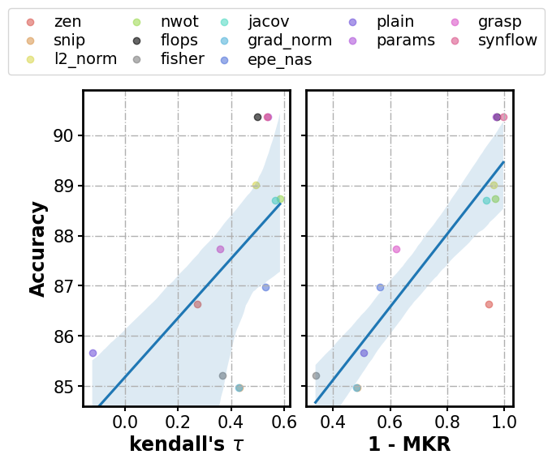

# Code Instruction

> Code for paper: A Good Performance Estimation is All You Need in Neural Architecture Search. Code is based on open source repository `XNAS`.

### KDT vs MKR

Run `scripts/PE-NAS/kdt_vs_mkr.py` to reproduce the result.



### reproduce SPOS and zero-cost

`bash examples/PE-NAS/re_spos.sh`

`bash examples/PE-NAS/re_zc.sh`

### Ours-A

#### NAS-bench-macro

`bash examples/PE-NAS/PE_NAS_A_macro.sh`

#### NAS-bench-201

`bash examples/PE-NAS/PE_NAS_A_201.sh`

#### NAS-bench-301

`bash examples/PE-NAS/PE_NAS_A_301.sh`

### Ours-B

#### NAS-bench-macro

`bash examples/PE-NAS/PE_NAS_B_macro.sh`

#### NAS-bench-201

`bash examples/PE-NAS/PE_NAS_B_201.sh`

#### NAS-bench-301

`bash examples/PE-NAS/PE_NAS_B_301.sh`

### Ours-C

#### NAS-bench-macro

`bash examples/PE-NAS/PE_NAS_C_macro.sh`

#### NAS-bench-201

`bash examples/PE-NAS/PE_NAS_C_201.sh`

#### NAS-bench-301

`bash examples/PE-NAS/PE_NAS_C_301.sh`

### Retrain DARTS

We follow [PC-DARTS](https://github.com/yuhuixu1993/PC-DARTS) using the same settings to retrain the searched architecture on the CIFAR-10 and ImageNet for a fair comparison.

```bash
git clone https://github.com/yuhuixu1993/PC-DARTS.git && cd ./PC-DARTS

# retrain on CIFAR-10
PYTHONPATH='./' python train.py  --auxiliary  --cutout --arch "Genotype(normal=[('skip_connect', 0), ('sep_conv_3x3', 1), ('dil_conv_3x3', 1), ('sep_conv_5x5', 2), ('sep_conv_3x3', 2), ('sep_conv_3x3', 3), ('sep_conv_3x3', 1), ('sep_conv_3x3', 3)], normal_concat=[2, 3, 4, 5], reduce=[('sep_conv_3x3', 0), ('sep_conv_3x3', 1), ('avg_pool_3x3', 1), ('dil_conv_3x3', 2), ('avg_pool_3x3', 0), ('sep_conv_3x3', 1), ('max_pool_3x3', 0), ('max_pool_3x3', 1)], reduce_concat=[2, 3, 4, 5])"

# retrain on ImageNet
PYTHONPATH='./' python train_imagenet.py --tmp_data_dir /path/to/your/data --save log_path --auxiliary  --arch "Genotype(normal=[('skip_connect', 0), ('sep_conv_3x3', 1), ('dil_conv_3x3', 1), ('sep_conv_5x5', 2), ('sep_conv_3x3', 2), ('sep_conv_3x3', 3), ('sep_conv_3x3', 1), ('sep_conv_3x3', 3)], normal_concat=[2, 3, 4, 5], reduce=[('sep_conv_3x3', 0), ('sep_conv_3x3', 1), ('avg_pool_3x3', 1), ('dil_conv_3x3', 2), ('avg_pool_3x3', 0), ('sep_conv_3x3', 1), ('max_pool_3x3', 0), ('max_pool_3x3', 1)], reduce_concat=[2, 3, 4, 5])"
```


## AttentiveNAS

```
{'subnet_cfg': {'resolution': 288, 'width': [16, 16, 24, 32, 72, 120, 200, 216, 1792], 'depth': [2, 3, 3, 5, 6, 8, 2], 'kernel_size': [5, 5, 5, 5, 5, 3, 5], 'expand_ratio': [1, 4, 5, 5, 4, 6, 6]}, 'flops': 979.515488, 'score': [222.16914862807695, 2663.55419921875, 230.55215454101562]}
```

## Segmentation

Our search space is based on [TopFormer](https://github.com/hustvl/TopFormer).

### Ours-base

```
flops: 1.79 cfg:
 {'width': [16, 16, 24, 72, 128, 176],
  'depth': [1, 1, 2, 2, 4], 
  'kernel_size': [5, 3, 3, 3, 3], 
  'expand_ratio': [1, 4, 2, 2, 5], 
  'num_heads': [10, 8, 12, 4], 
  'key_dim': [18, 16, 16, 16], 
  'attn_ratio': [1.6, 2.2, 1.8, 2.0], 
  'mlp_ratio': [2.2, 2.2, 1.6, 2.0], 
  'transformer_depth': [2, 1, 2, 2]}
```

### Ours-small

```
flops: 1.18 cfg: {
    'width': [16, 16, 16, 48, 96, 136],
    'depth': [2, 2, 1, 3, 4],
    'kernel_size': [5, 3, 5, 3, 3],
    'expand_ratio': [1, 3, 3, 2, 6],
    'num_heads': [6, 4, 4, 8],
    'key_dim': [16, 14, 16, 14],
    'attn_ratio': [1.6, 1.8, 1.8, 1.8],
    'mlp_ratio': [2.2, 1.8, 2.0, 1.8],
    'transformer_depth': [2, 1, 2, 2]}
```

### Ours-tiny

```
flops: 0.58 cfg: {
    'width': [16, 16, 24, 32, 56, 104],
    'depth': [1, 1, 1, 3, 3],
    'kernel_size': [3, 3, 5, 3, 5],
    'expand_ratio': [1, 3, 2, 2, 6],
    'num_heads': [6, 10, 4, 10],
    'key_dim': [18, 16, 18, 14],
    'attn_ratio': [1.8, 2.0, 1.6, 1.8],
    'mlp_ratio': [2.4, 2.0, 2.2, 1.8],
    'transformer_depth': [1, 2, 2, 2]}
```

